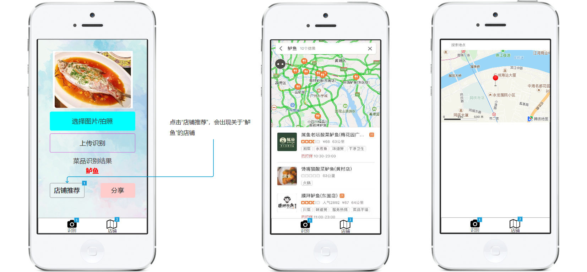

# 微信小程序
基于微信小程序的一个菜品识别并查询、推荐有关店铺的应用  

### [产品PRD](https://github.com/kkrrystal2/API_ML_AI/blob/master/PRD.md)  
* Goals  
* Background and strategic fit  
* Assumptions  
* Requirements  
* User interaction and design  
* Questions  
* Not doing

### 效果图  
* [原型效果连接](https://kkrrystal2.github.io/prototype/)

### 功能
* 识别菜品
* 发现相关菜品的店铺推荐

### 用到的API
* 百度菜品识别API  
* 腾讯地图API

### 已实现的功能  
* 可拍照识别菜品  
* 可查看相关店铺  
* 目前进度

### 待解决
* 菜品和相关店铺推荐不能实现联动  
* 腾讯地图不能搜索附件美食  

