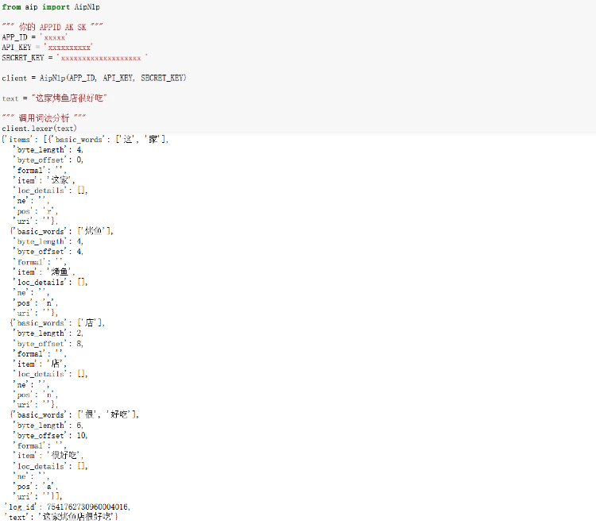
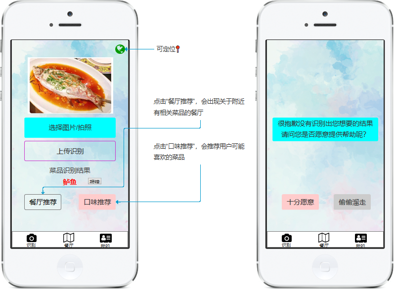
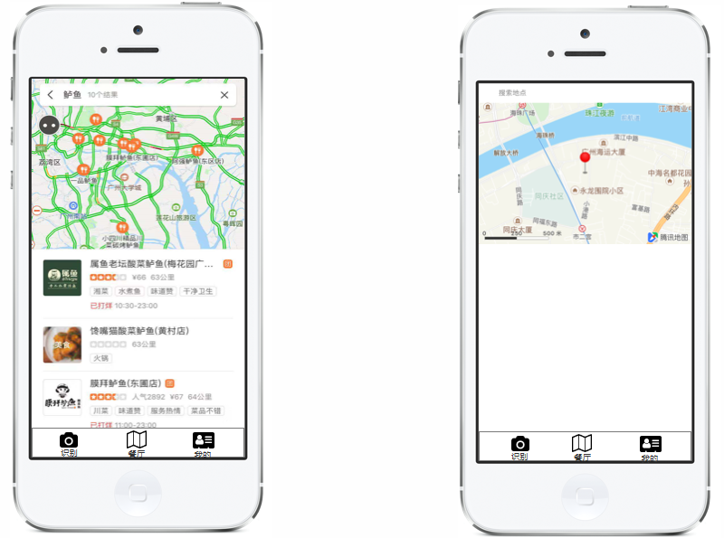
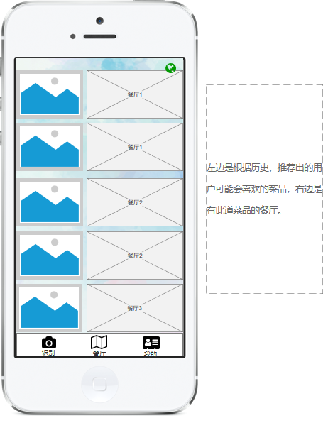
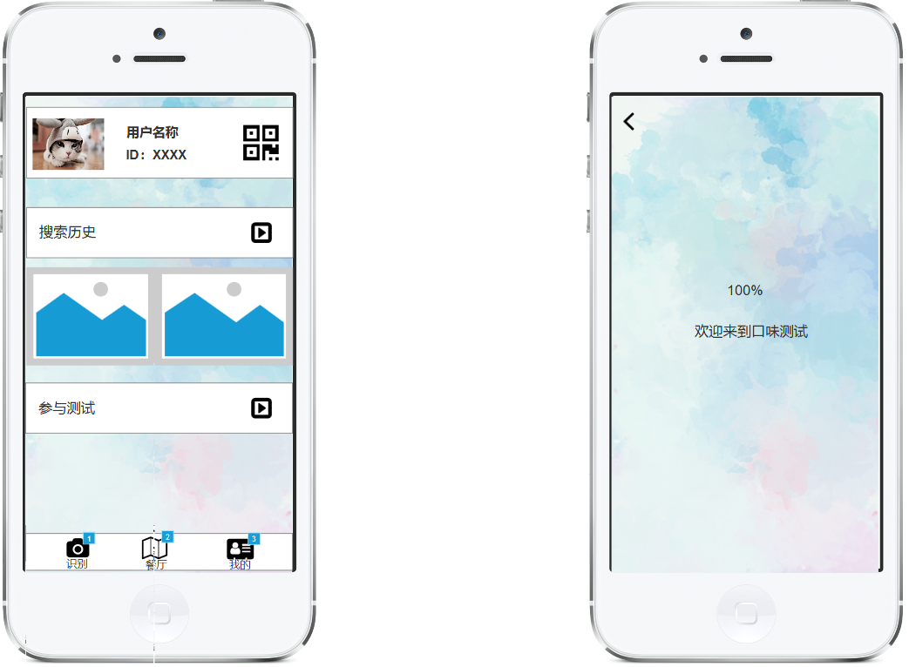

# 微信小程序
基于微信小程序的一个菜品识别并查询、推荐附近餐厅和用户喜欢的菜品的应用  


|         |            |
| ------------- |:-------------:|
| Target release     | 2019年1月8日 |
| Epic      |  菜品识别与附近餐厅和用户可能喜欢的菜品推荐   |
| Document status | 已开始      |
| Designer        | 甘瑜 |
| Developer       | 甘瑜 |
| QA | 甘瑜  |


## [产品PRD](https://github.com/kkrrystal2/API_ML_AI/blob/master/PRD.md)  
### Goals
* 随时随地，拿起手机，满足用户想要知道菜品名字的好奇心.  
* 并通过查询得到的结果，找寻到附近餐厅.  
* 通过搜索历史，形成用户每天的菜谱，即每天吃什么.

### 加值宣言  
* 民以食为天，互联网时代的到来，让菜品识别以AI的形式落入平常百姓家.但是，现代社会生活和工作节奏很快，大多数人很少花时间自己做菜，所以通过相关餐厅推荐（百度评论观点抽取API筛选餐厅）可以满足用户的需求.还可以通过用户的搜索纪录，来推荐用户可能喜欢的菜品.  

### 核心价值  
* 通过拍照/上传图片的方式，最小实现对图片的输出（即菜名），并推荐有附近菜品的餐厅，解决用户“吃饭难”问题. 

### 用户使用场景 

|      |    Title     |       User story     |      Importance     |      Notes     |
| ------------- |:-------------:|:-------------:|:-------------:|:-------------:|
| 1        |   输出菜名后，想知道附近餐厅    | 需要点击餐厅推荐 | Must Have |  |  
| 2        |   输出菜名后，想知道更多用户口味    | 需要点击口味推荐 | Not doing | 记录越多，每日推荐越接近用户口味 |

### 用户目标  
* 通过拍摄/上传一种菜品的图片可获得此菜品的信息，并通过点击餐厅推荐，获取附近菜品的餐厅，发现美味，通过口味推荐，让用户感受舌尖味蕾的跳动，增加用户粘性。  

* 用户心里需求：  

|    Question     |       Answer     |
| ------------- |:-------------:|
|   用户为什么要用这个小程序？      |   用户想要了解眼前这道菜品的信息/附近餐厅推荐/口味推荐   |  
|   附近餐厅是怎么推荐来的？      |   不是关键词搜索，而是通过获取美团外卖查询门店菜品分类API筛选附近餐厅，并且通过百度评论观点抽取API推荐   |
|   用户喜欢的口味是怎么推荐来的？      |   通过推荐系统（暂时not doing）推荐   |  

* 解决用户痛点：

1. 吃饭的时候（离家/公司较远），想知道家/公司附近有没有相同的菜品；  
2. 在网络上看到一张想吃的菜的图片，通过搜索得到菜名，并推荐附近餐厅；  
3. 通过搜索记录，形成用户喜欢的菜品推荐，解决“每天吃什么”的烦恼.

### 人工智能概率性  
* 使用百度菜品识别API，若有相似的菜（e.g.鲈鱼和桂花鱼，做法与外表相似）则出现的结果会是鲈鱼，但也有30%的概率会显示相近的结果.  
* 如果一道菜中有多种食物，则可能识别不出或识别错误.  

## API  
* [百度菜品识别](https://cloud.baidu.com/doc/IMAGERECOGNITION/ImageClassify-API.html#.E8.AF.B7.E6.B1.82.E8.AF.B4.E6.98.8E)   
* [百度评论观点抽取API](http://ai.baidu.com/docs#/NLP-API/top)  
* [腾讯地图API](https://lbs.qq.com/qqmap_wx_jssdk/index.html)   
* [美团外卖查询菜品详情API](http://developer.waimai.meituan.com/home/docDetail/69)   （个人不能调用，需要企业）   


### API对比
#### [百度菜品识别](https://cloud.baidu.com/doc/IMAGERECOGNITION/ImageClassify-API.html#.E8.AF.B7.E6.B1.82.E8.AF.B4.E6.98.8E) 

* 测试图片1：鳕鱼  

  

* 代码展示1：

```

from aip import AipImageClassify
""" 你的 APPID AK SK """
APP_ID = 'XXXXX'
API_KEY = 'XXXXXXXX'
SECRET_KEY = 'XXXXXXXXXXXXXXXX'
client = AipImageClassify(APP_ID, API_KEY, SECRET_KEY)
def get_file_content(filePath):
    with open('C:\\Users\\PC20161006-02\\Desktop\\鳕鱼.jpg', 'rb') as fp:
        return fp.read()
image = get_file_content('6.jpg')
""" 如果有可选参数 """
options = {}
options["top_num"] = 3
options["filter_threshold"] = "0.7"
options["baike_num"] = 5
""" 带参数调用菜品识别 """
a=client.dishDetect(image, options)
print(a)

{'log_id': 4386457302901247568, 'result_num': 3, 'result': [{'calorie': '175', 'has_calorie': True, 'name': '煎鳕鱼', 'probability': '0.54478', 'baike_info': {'baike_url': 'http://baike.baidu.com/item/%E7%85%8E%E9%B3%95%E9%B1%BC/4383573', 'description': '煎鳕鱼是一道以鳕鱼肉为主要食材制作的美食。'}}, {'calorie': '170', 'has_calorie': True, 'name': '银鳕鱼', 'probability': '0.129811', 'baike_info': {'baike_url': 'http://baike.baidu.com/item/%E8%A3%B8%E7%9B%96%E9%B1%BC/6304576', 'image_url': 'http://imgsrc.baidu.com/baike/pic/item/b94f65ec2c7fc5ef2e2e217c.jpg', 'description': '裸盖鱼(学名：Anoplopoma fimbria)是黑鲉科、裸盖鱼属鱼类。主要分布于北冰洋，北太平洋。这种鱼属冷水域之深海鱼其营养价值极高，含有脂肪，蛋白质及多种维生素。裸盖鱼因酷似鳕鱼，所以最先由日本市场命名为“银鳕鱼”，价格比真正的鳕鱼贵许多。由于其营养价值高，所以经常被用来烹调美食，广泛分布于世界的海域。'}}, {'calorie': '83', 'has_calorie': True, 'name': '龙利鱼', 'probability': '0.0507464', 'baike_info': {'baike_url': 'http://baike.baidu.com/item/%E9%BE%99%E5%88%A9%E9%B1%BC/4682756', 'image_url': 'http://imgsrc.baidu.com/baike/pic/item/4e4a20a4462309f78c7fb8fb720e0cf3d6cad6c2.jpg', 'description': '龙利鱼属鲽形目、舌鳎科、舌鳎属，俗称子板鱼、鳎目、鳎米，是一种暖温性近海大型底层鱼类，终年生活栖息在中国近海海区，具广温、广盐和适应多变的环境条件的特点，适温范围3.5—32℃，最适水温14—24℃，适盐范围14-33‰。半滑舌鳎自然资源量少，味鲜鲜美，出肉率高，口感爽滑，鱼肉久煮而不老，无腥味和异味，属于高蛋白，营养丰富，历来为中国沿海广大消费者待客的上等佳品，深受广大消费者青睐，目前活鱼价格很高。加之，半滑舌鳎生长速度快，食物层次低，能耐低氧，病害少，适合在目前养殖大菱鲆、牙鲆的大棚内养殖。'}}]}  

```


 
* 测试图片2：桂花鱼

  

* 代码展示2：  

```
from aip import AipImageClassify
""" 你的 APPID AK SK """
APP_ID = 'xxxxxxxxx'
API_KEY = 'xxxxxxxxxxx'
SECRET_KEY = 'xxxxxxxxxxxxxxxxx'
client = AipImageClassify(APP_ID, API_KEY, SECRET_KEY)
def get_file_content(filePath):
    with open('C:\\Users\\PC20161006-02\\Desktop\\guihuayu.jpg', 'rb') as fp:
        return fp.read()
image = get_file_content('6.jpg')
""" 如果有可选参数 """
options = {}
options["top_num"] = 3
options["filter_threshold"] = "0.7"
options["baike_num"] = 5
""" 带参数调用菜品识别 """
a=client.dishDetect(image, options)
print(a)  

{'log_id': 3475128781405538096, 'result_num': 3, 'result': [{'calorie': '118', 'has_calorie': True, 'name': '蒸鲈鱼', 'probability': '0.3477', 'baike_info': {'baike_url': 'http://baike.baidu.com/item/%E8%92%B8%E9%B2%88%E9%B1%BC/3121965', 'image_url': 'http://imgsrc.baidu.com/baike/pic/item/a2cc7cd98d1001e9ea59841abb0e7bec54e797ba.jpg', 'description': '蒸鲈鱼是一道色香味俱全的传统名菜，属于湘菜，鲁菜或粤菜。鲈鱼肉质白嫩、清香，没有腥味，肉为蒜瓣形，最宜清蒸、红烧或炖汤。 鲈鱼品种很多，如黄鲈、湖鲈、白鲈等。鲈鱼体侧偏，成鱼长30～60cm，嘴大，背厚，鳞小，栖于近海，冬季回游到淡水中，性凶猛，以小鱼虾等为食。鲈鱼肉呈白色，刺少，肉质细嫩、爽滑，鲜味突出。鲈鱼在全世界温带沿海地区均有出产，以加拿大,澳大利亚产量最高。'}}, {'calorie': '135', 'has_calorie': True, 'name': '清蒸鱼', 'probability': '0.327215', 'baike_info': {'baike_url': 'http://baike.baidu.com/item/%E6%B8%85%E8%92%B8%E9%B1%BC/2415961', 'image_url': 'http://imgsrc.baidu.com/baike/pic/item/024f78f0f736afc37ebbedcab919ebc4b64512ed.jpg', 'description': '清蒸鱼是用各类鱼制作的一道家常菜，主要原材料有鱼、生姜、香蒜等，口味咸鲜，鱼肉软嫩，鲜香味美，汤清味醇，具有养血和开胃的功效，是舌尖上的美食。'}}, {'calorie': '92', 'has_calorie': True, 'name': '石斑鱼', 'probability': '0.0567716', 'baike_info': {'baike_url': 'http://baike.baidu.com/item/%E7%9F%B3%E6%96%91%E9%B1%BC/425506', 'image_url': 'http://imgsrc.baidu.com/baike/pic/item/c2cec3fdfc039245c2dd67168194a4c27d1e25ba.jpg', 'description': '黑猫鱼即石斑鱼，沿海当地居民俗称。生活在海边石头缝隙，有海中鲤鱼之称，实际上食用价值和味道高于鲤鱼。比常见鱼类价格偏贵。石斑鱼，属鲈形目，体长椭圆形稍侧扁。口大，具辅上颌骨，牙细尖，有的扩大成犬牙。体被小栉鳞，有时常埋于皮下。背鳍,臀鳍棘发达，尾鳍圆形或凹形，体色变异甚多，常呈褐色或红色，并具条纹和斑点，为暖水性的大中型海产鱼类。石斑鱼营养丰富，肉质细嫩洁白，类似鸡肉，素有“海鸡肉”之称。石斑鱼又是一种低脂肪、高蛋白的上等食用鱼，被港澳地区推为中国四大名鱼之一。'}}]}

```


* 测试图片3：鲈鱼

  

* 代码展示3：

```

from aip import AipImageClassify
""" 你的 APPID AK SK """
APP_ID = 'xxxxxxx'
API_KEY = 'xxxxxxxxxxx'
SECRET_KEY = 'xxxxxxxxxxxxxx'
client = AipImageClassify(APP_ID, API_KEY, SECRET_KEY)
def get_file_content(filePath):
    with open('C:\\Users\\PC20161006-02\\Desktop\\guihuayu2.jpg', 'rb') as fp:
        return fp.read()
image = get_file_content('6.jpg')
""" 如果有可选参数 """
options = {}
options["top_num"] = 3
options["filter_threshold"] = "0.7"
options["baike_num"] = 5
""" 带参数调用菜品识别 """
a=client.dishDetect(image, options)
print(a)

{'log_id': 936881095380766064, 'result_num': 3, 'result': [{'calorie': '118', 'has_calorie': True, 'name': '蒸鲈鱼', 'probability': '0.393649', 'baike_info': {'baike_url': 'http://baike.baidu.com/item/%E8%92%B8%E9%B2%88%E9%B1%BC/3121965', 'image_url': 'http://imgsrc.baidu.com/baike/pic/item/a2cc7cd98d1001e9ea59841abb0e7bec54e797ba.jpg', 'description': '蒸鲈鱼是一道色香味俱全的传统名菜，属于湘菜，鲁菜或粤菜。鲈鱼肉质白嫩、清香，没有腥味，肉为蒜瓣形，最宜清蒸、红烧或炖汤。 鲈鱼品种很多，如黄鲈、湖鲈、白鲈等。鲈鱼体侧偏，成鱼长30～60cm，嘴大，背厚，鳞小，栖于近海，冬季回游到淡水中，性凶猛，以小鱼虾等为食。鲈鱼肉呈白色，刺少，肉质细嫩、爽滑，鲜味突出。鲈鱼在全世界温带沿海地区均有出产，以加拿大,澳大利亚产量最高。'}}, {'calorie': '-1', 'has_calorie': True, 'name': '油淋鲈鱼', 'probability': '0.225333', 'baike_info': {'baike_url': 'http://baike.baidu.com/item/%E6%B2%B9%E6%B7%8B%E9%B2%88%E9%B1%BC/7563378', 'description': '油淋鲈鱼是一道以鲈鱼、香菜段、姜丝等为主要食材制作的美食。'}}, {'calorie': '135', 'has_calorie': True, 'name': '清蒸鱼', 'probability': '0.17866', 'baike_info': {'baike_url': 'http://baike.baidu.com/item/%E6%B8%85%E8%92%B8%E9%B1%BC/2415961', 'image_url': 'http://imgsrc.baidu.com/baike/pic/item/024f78f0f736afc37ebbedcab919ebc4b64512ed.jpg', 'description': '清蒸鱼是用各类鱼制作的一道家常菜，主要原材料有鱼、生姜、香蒜等，口味咸鲜，鱼肉软嫩，鲜香味美，汤清味醇，具有养血和开胃的功效，是舌尖上的美食。'}}]}  


```

#### [腾讯图片识别](https://ai.qq.com/product/visionimgidy.shtml#scene) 

* 输入输出展示：

  

#### [阿里云图像识别](https://data.aliyun.com/ai?spm=5176.12127922.1238513.3.30306c06Elegza#/image-tag) 

* 输入输出展示：


#### 百度菜品识别API结果分析：

| 菜品        | 方式    |  精准概率  |
| --------   | -----:   | :----: |
| 鲈鱼        | 网络保存图片      |   >90%   |
| 桂花鱼        | 网络保存图片      |   >30%    |
| 鳕鱼        | 网络保存图片      |   >90%    |  

1.对于输入的一张图片（可正常解码，且长宽比适宜），可输出图片的菜品名称、卡路里信息、置信度  
2.使用百度菜品识别API，若有相似的菜（e.g.鲈鱼和桂花鱼，做法与外表相似）则出现的结果会是鲈鱼，但也有30%的概率会显示相近的结果.  
3.如果一道菜中有多种食物，则可能识别不出或识别错误.  

#### 三个API对比分析：  

|    百度菜品识别API    | 腾讯图片识别API    |  阿里云图像识别API  |
| --------   | -----:   | :----: |
| 同上        | 只能识别是否是美食      |   只能给食物打标签   |
| 总体上说，百度菜品识别API有其优势   |  

#### [百度评论观点抽取API](http://ai.baidu.com/docs#/NLP-API/top)  

* 输入输出展示：

  

#### [腾讯地图API](https://ai.qq.com/product/visionimgidy.shtml#scene)  

* 代码展示：

   

#### [美团外卖查询菜品详情API](http://developer.waimai.meituan.com/home/docDetail/69)  

* 代码展示：

 

#### API使用风险报告  

|      |    百度菜品识别API     |   腾讯图片识别API     |  阿里云图像识别API     |  百度评论观点抽取API     |  美团外卖查询门店菜品分类API     | 
| ------------- |:-------------:|:-------------:|:-------------:|:-------------:|:-------------:|
| 市场现状   |  许多APP中已有调用，如：[AI美食相机](http://ai.baidu.com/customer/meishi)、[识菜君](http://ai.baidu.com/customer/vsapp)  | 主要运用于图片打标和图片分类，如QQ空间 |  主要运用于图片识别，如淘宝拍照识图 | 许多APP中已有调用，如：[房天下](http://ai.baidu.com/customer/meishi) |  只能企业开发 |    
| 输入输出限制      |   免费：500次/天    | 未认证用户1次/s，认证用户2次/s，企业10次/s |  5000次/1年  |   无限制  |   未知 |   
| 定价      |  0.7元/千次（0<月计费调用量≤5w）    | 免费 |   0.0025 元/张 |   免费 |    未知 |   

## 产品设计  

* 产品框架图：

  

* [原型效果链接]低交互，可点击下面三个选项（识别、餐厅、我的）(https://kkrrystal2.github.io/prototype/)

  

  

  




* 产品功能描述：  
1.上传图片后，识别出菜品，如果用户觉得有错误，可以通过点击“识别结果”旁边的“报错”进行反馈，弹出反馈的页面。  
2.点击餐厅推荐，可跳到餐厅推荐的页面。（绿色地球的icon可以实现定位）  
3.点击口味推荐，可跳到口味推荐的页面（根据搜索历史，推荐用户可能喜欢的口味）  

* 迭代发展构想：  
1.API漏洞：①通过用户的报错、②未识别出结果后用户的数据上传，提高API的精准度。  
2.游戏化设计：通过用户可能喜欢的菜品测试，增加小程序的趣味性，增强用户粘性。


## 清单  
* [产品PRD](https://github.com/kkrrystal2/API_ML_AI/blob/master/PRD.md)  
* 调用的API  
  * [百度菜品识别](https://cloud.baidu.com/doc/IMAGERECOGNITION/ImageClassify-API.html#.E8.AF.B7.E6.B1.82.E8.AF.B4.E6.98.8E)   
  * [百度评论观点抽取API](http://ai.baidu.com/docs#/NLP-API/top)  
  * [腾讯地图API](https://lbs.qq.com/qqmap_wx_jssdk/index.html)   
  * [美团外卖查询菜品详情API](http://developer.waimai.meituan.com/home/docDetail/69)  
* 比对API
  * [腾讯图片识别](https://ai.qq.com/product/visionimgidy.shtml#scene)   
  * [阿里云图像识别](https://data.aliyun.com/ai?spm=5176.12127922.1238513.3.30306c06Elegza#/image-tag)   
* [原型效果链接](https://kkrrystal2.github.io/prototype/)  
* 举例  
  * [AI美食相机](http://ai.baidu.com/customer/meishi)  
  * [识菜君](http://ai.baidu.com/customer/vsapp)  
  * [房天下](http://ai.baidu.com/customer/meishi)
