# 微信小程序
基于微信小程序的一个菜品识别并查询、推荐有关餐厅和用户喜欢的菜品的应用  

|         |            |
| ------------- |:-------------:|
| Target release     | 未定 |
| Epic      |  菜品识别与相关餐厅和用户可能喜欢的菜品推荐   |
| Document status | 已开始      |
| Designer        | 甘瑜 |
| Developer       | 甘瑜 |
| QA | 甘瑜  |

## [产品PRD](https://github.com/kkrrystal2/API_ML_AI/blob/master/PRD.md)  
### Goals
* 随时随地，拿起手机，满足用户想要知道菜品名字的好奇心.  
* 并通过查询得到的结果，找寻到相关餐厅.  
* 通过搜索历史，形成用户每天的菜谱，即每天吃什么.

### 加值宣言  
* 民以食为天，互联网时代的到来，让菜品识别以AI的形式落入平常百姓家.但是，现代社会生活和工作节奏很快，大多数人很少花时间自己做菜，所以通过相关餐厅推荐（百度评论观点抽取API筛选餐厅）可以满足用户的需求.还可以通过用户的搜索纪录，来推荐用户可能喜欢的菜品.  

### 核心价值  
* 通过拍照/上传图片的方式，最小实现对图片的输出（即菜名），并推荐有相关菜品的餐厅，解决用户“吃饭难”问题. 

### 用户使用场景 

|      |    Title     |       User story     |      Importance     |      Notes     |
| ------------- |:-------------:|:-------------:|:-------------:|:-------------:|
| 1        |   输出菜名后，想知道相关餐厅    | 需要点击餐厅推荐 | Must Have |  |  
| 2        |   输出菜名后，想知道更多用户口味    | 需要点击口味推荐 | Not doing | 记录越多，每日推荐越接近用户口味 |

### 用户目标  
* 通过拍摄/上传一种菜品的图片可获得此菜品的信息，并通过点击餐厅推荐，获取相关菜品的餐厅，发现美味，通过口味推荐，让用户感受舌尖味蕾的跳动，增加用户粘性。  

* 用户心里需求：  

|    Question     |       Answer     |
| ------------- |:-------------:|
|   用户为什么要用这个小程序？      |   用户想要了解眼前这道菜品的信息/相关餐厅推荐/口味推荐   |  
|   相关餐厅是怎么推荐来的？      |   不是关键词搜索，而是通过获取美团外卖查询门店菜品分类API筛选相关店铺，并且通过百度评论观点抽取API推荐   |
|   用户喜欢的口味是怎么推荐来的？      |   通过推荐系统（暂时not doing）推荐   |  

* 解决用户痛点：

1. 吃饭的时候（离家/公司较远），想知道家/公司附近有没有相同的菜品；  
2. 在网络上看到一张想吃的菜的图片，通过搜索得到菜名，并推荐相关餐厅；  
3. 通过搜索记录，形成用户喜欢的菜品推荐，解决“每天吃什么”的烦恼.

### 人工智能概率性  
* 使用百度菜品识别API，若有相似的菜（e.g.鲈鱼和桂花鱼，做法与外表相似）则出现的结果会是鲈鱼，但也有30%的概率会显示相近的结果.  
* 如果一道菜中有多种食物，则可能识别不出或识别错误.  

## API  
* [百度菜品识别](https://cloud.baidu.com/doc/IMAGERECOGNITION/ImageClassify-API.html#.E8.AF.B7.E6.B1.82.E8.AF.B4.E6.98.8E)   
* [百度评论观点抽取API](http://ai.baidu.com/docs#/NLP-API/top)  
* [腾讯地图API](https://lbs.qq.com/qqmap_wx_jssdk/index.html)   
* [美团外卖查询查询菜品详情API](http://developer.waimai.meituan.com/home/docDetail/69)   （个人不能调用，需要企业）   

### API对比
#### [百度菜品识别](https://cloud.baidu.com/doc/IMAGERECOGNITION/ImageClassify-API.html#.E8.AF.B7.E6.B1.82.E8.AF.B4.E6.98.8E) 

* 测试图片1：鳕鱼  

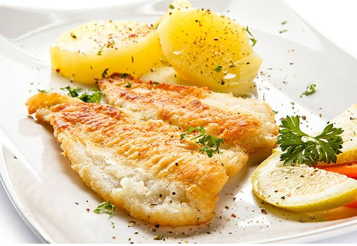  

* 代码展示1：

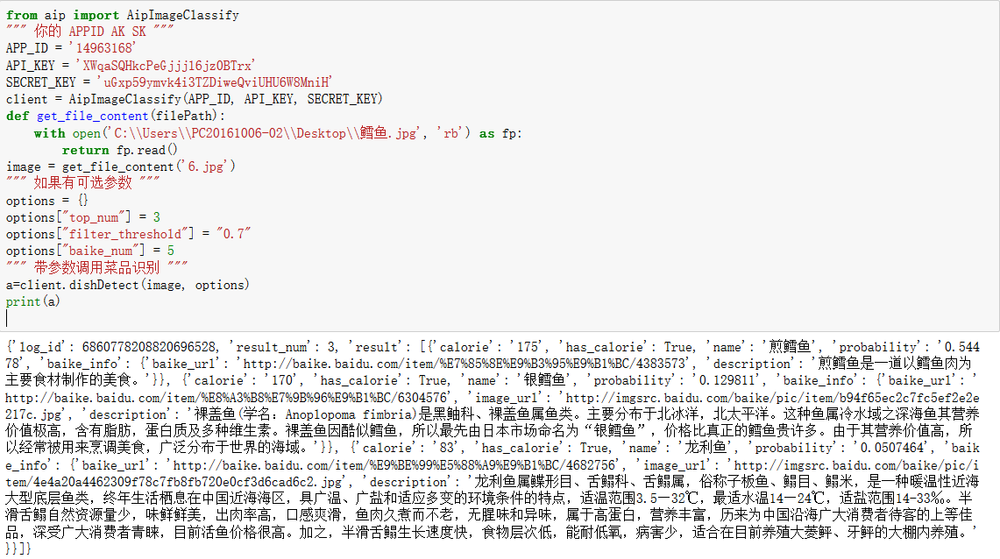  

* 测试图片2：桂花鱼

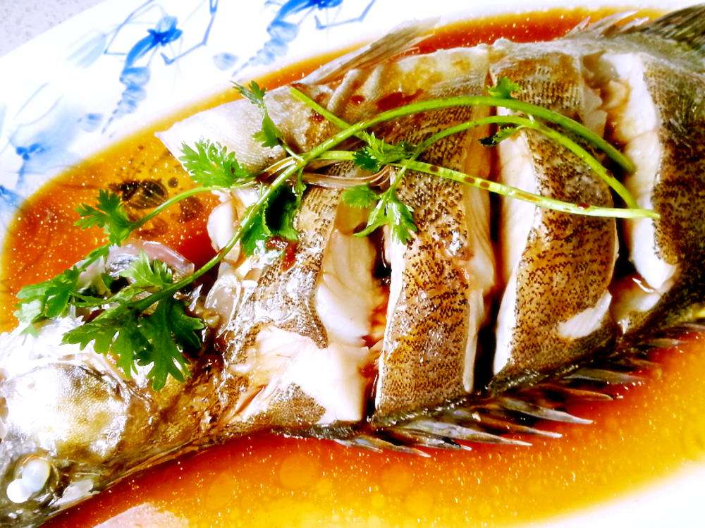  

* 代码展示2：

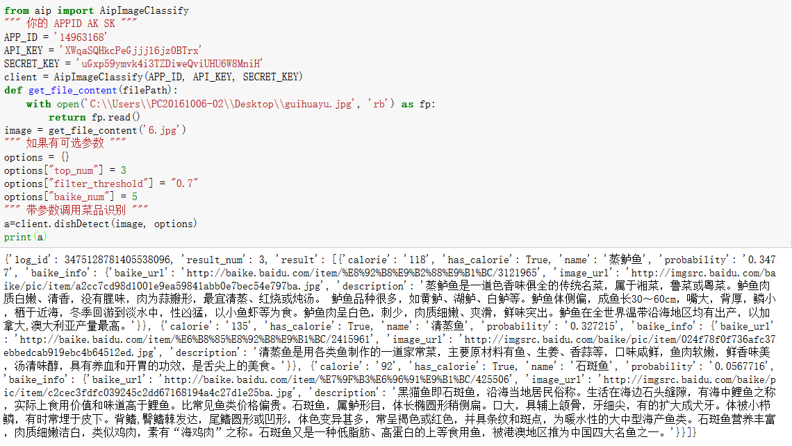  

* 测试图片3：鲈鱼

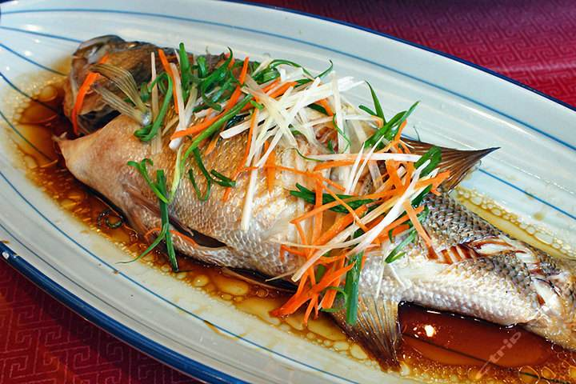  

* 代码展示3：

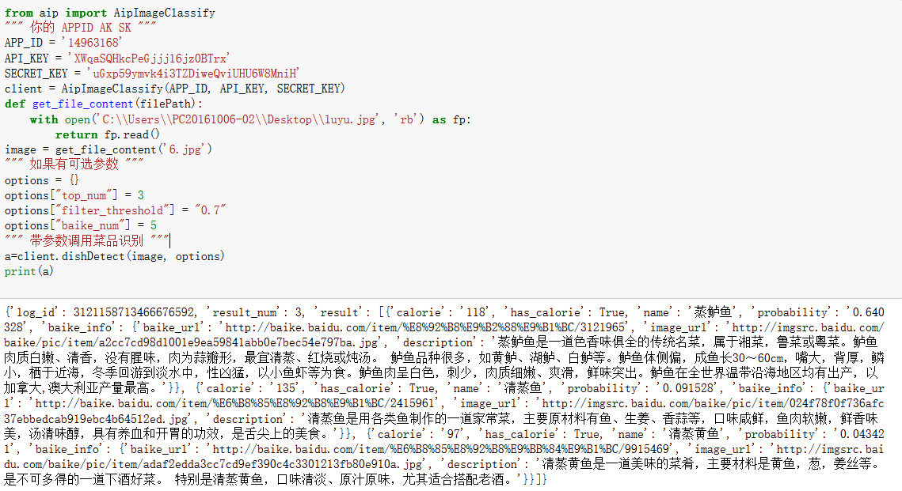  

#### [腾讯图片识别](https://ai.qq.com/product/visionimgidy.shtml#scene) 

* 输入输出展示：

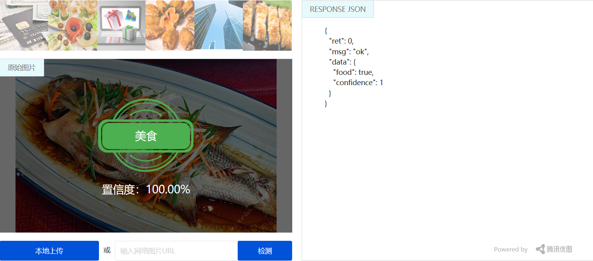  

#### [阿里云图像识别](https://data.aliyun.com/ai?spm=5176.12127922.1238513.3.30306c06Elegza#/image-tag) 

* 输入输出展示：

#### 百度菜品识别API结果分析：

| 菜品        | 方式    |  精准概率  |
| --------   | -----:   | :----: |
| 鲈鱼        | 网络保存图片      |   >90%   |
| 桂花鱼        | 网络保存图片      |   >30%    |
| 鳕鱼        | 网络保存图片      |   >90%    |  

1.对于输入的一张图片（可正常解码，且长宽比适宜），可输出图片的菜品名称、卡路里信息、置信度  
2.使用百度菜品识别API，若有相似的菜（e.g.鲈鱼和桂花鱼，做法与外表相似）则出现的结果会是鲈鱼，但也有30%的概率会显示相近的结果.  
3.如果一道菜中有多种食物，则可能识别不出或识别错误.  

#### 三个API对比分析：  

|    百度菜品识别API    | 腾讯图片识别API    |  阿里云图像识别API  |
| --------   | -----:   | :----: |
| 同上        | 只能识别是否是美食      |   只能给食物打标签   |
| 总体上说，百度菜品识别API有其优势   |  

#### [百度评论观点抽取API](http://ai.baidu.com/docs#/NLP-API/top)  

* 输入输出展示：

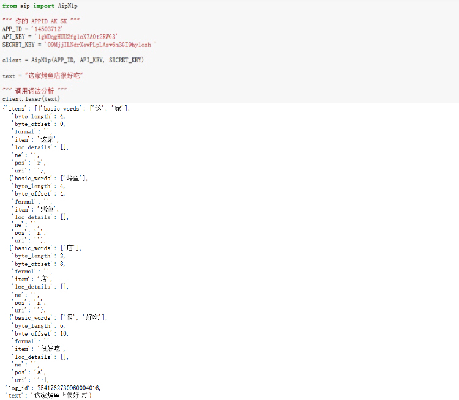  

#### [腾讯地图API](https://ai.qq.com/product/visionimgidy.shtml#scene)  

* 代码展示：

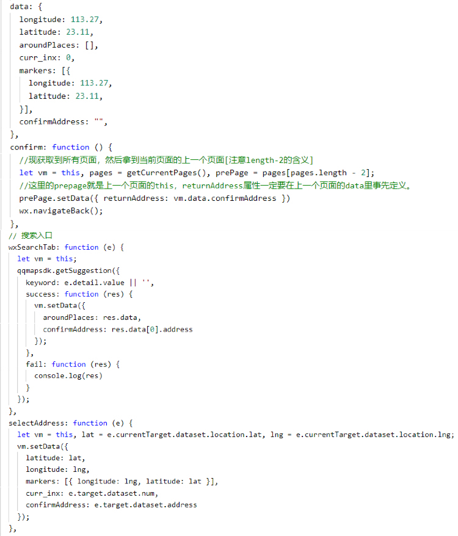   

#### [美团外卖查询菜品详情API](http://developer.waimai.meituan.com/home/docDetail/69)  

* 代码展示：

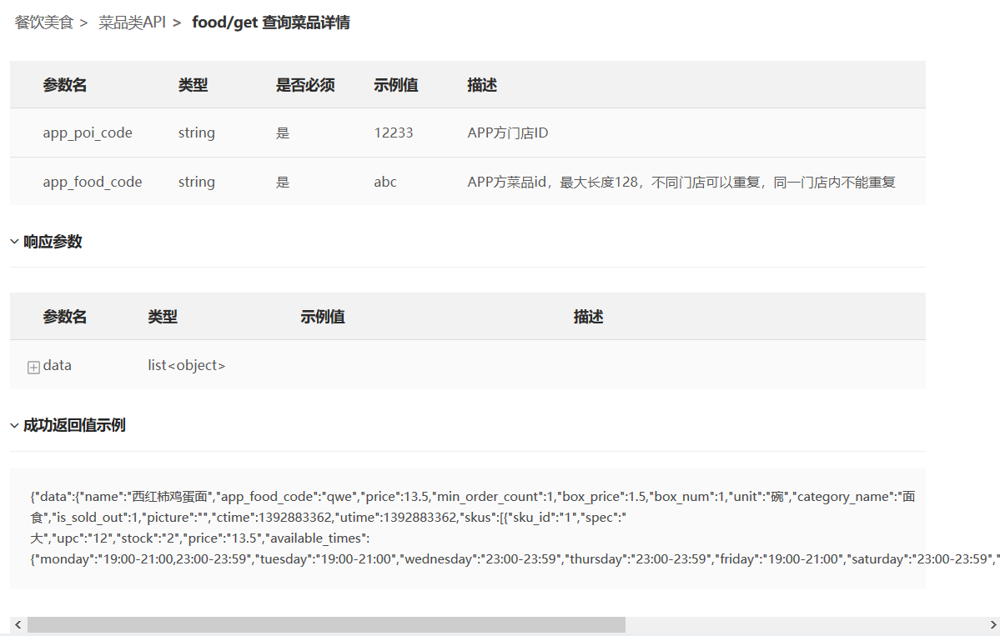 

#### API使用风险报告  

|      |    百度菜品识别API     |   腾讯图片识别API     |  阿里云图像识别API     |  百度评论观点抽取API     |  美团外卖查询门店菜品分类API     | 
| ------------- |:-------------:|:-------------:|:-------------:|:-------------:|:-------------:|
| 市场现状   |  许多APP中已有调用，如：[AI美食相机](http://ai.baidu.com/customer/meishi)、[识菜君](http://ai.baidu.com/customer/vsapp)  | 主要运用于图片打标和图片分类，如QQ空间 |  主要运用于图片识别，如淘宝拍照识图 | 许多APP中已有调用，如：[房天下](http://ai.baidu.com/customer/meishi) |  只能企业开发 |    
| 输入输出限制      |   免费：500次/天    | 未认证用户1次/s，认证用户2次/s，企业10次/s |  5000次/1年  |   无限制  |   未知 |   
| 定价      |  0.7元/千次（0<月计费调用量≤5w）    | 免费 |   0.0025 元/张 |   免费 |    未知 |   

## 产品设计  

* 产品框架图：

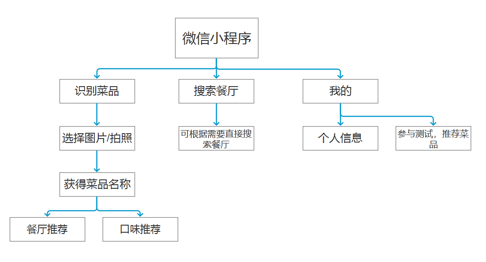  

* [原型效果链接](https://kkrrystal2.github.io/prototype/)

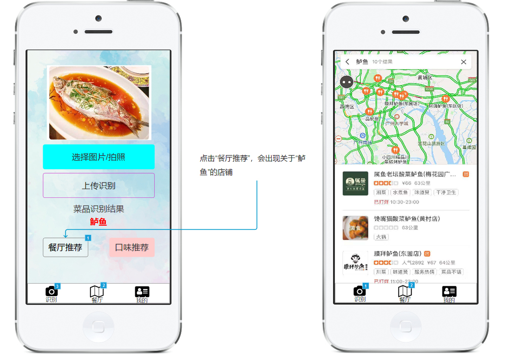  

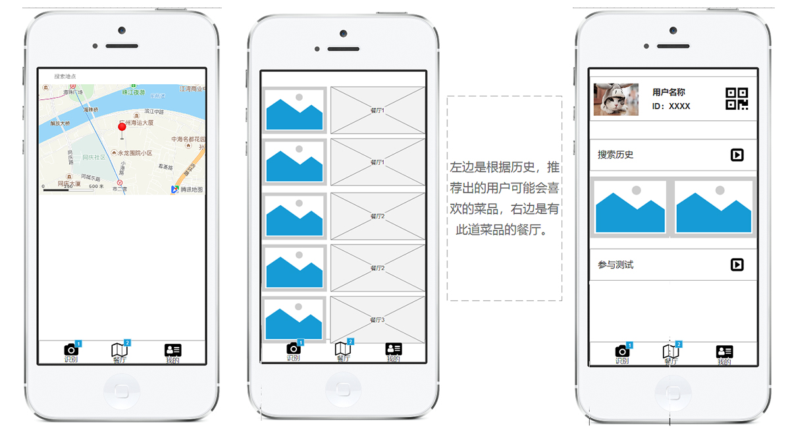  

* 产品功能描述：1.上传图片后，点击餐厅推荐，可跳到餐厅推荐的页面；2.点击口味推荐，可跳到口味推荐的页面（根据搜索历史，推荐用户可能喜欢的口味）

## 已实现的功能  
* 可拍照识别菜品  
* 可查看相关店铺  
* 目前进度  

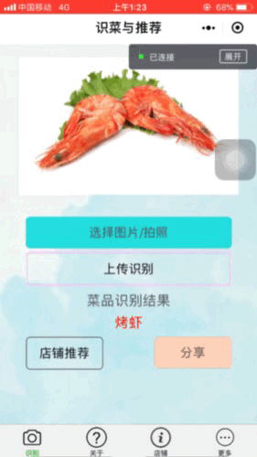

## 待解决
* 菜品和相关店铺推荐不能实现联动  
* 腾讯地图不能搜索附近美食  

