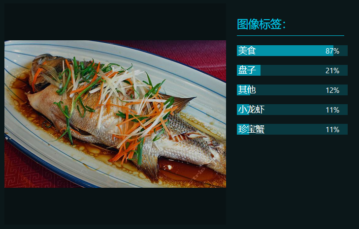

# 微信小程序
基于微信小程序的一个菜品识别并查询、推荐有关餐厅的应用  

### [产品PRD](https://github.com/kkrrystal2/API_ML_AI/blob/master/PRD.md)  
* 加值宣言：民以食为天，互联网时代的到来，让菜品识别以AI的形式落入平常百姓家.但是，现代社会生活和工作节奏很快，大多数人很少花时间自己做菜，所以通过相关餐厅推荐可以满足用户的需求.还可以通过用户的历史纪录，来推荐用户喜欢的菜品.  

* 核心价值：通过拍照/上传图片的方式，最小实现对图片的输出（即菜名），并推荐有相关菜品的餐厅. 

* 解决用户痛点：1.吃饭的时候（离家/公司较远），想知道家/公司附近有没有相同的菜品；2.在网络上看到一张想吃的菜的图片，通过搜索得到菜名，并推荐相关餐厅；3.通过搜索记录，形成用户喜欢的菜品推荐，解决“每天吃什么”的烦恼.

* 人工智能概率性:  

1.使用百度菜品识别API，若有相似的菜（e.g.鲈鱼和桂花鱼，做法与外表相似）则出现的结果会是鲈鱼，但也有30%的概率会显示相近的结果.  
2.如果一道菜中有多种食物，则可能识别不出或识别错误.

### API对比
* 百度菜品识别API  

测试图片1：鳕鱼  

  

代码展示1：

  

测试图片2：桂花鱼

  

代码展示2：

  

测试图片3：鲈鱼

  

代码展示3：

  

* 腾讯图片识别API 

输入输出展示：

  

* 阿里云图像识别API 

输入输出展示：

* 百度菜品识别API结果分析：

| 菜品        | 方式    |  精准概率  |
| --------   | -----:   | :----: |
| 鲈鱼        | 网络保存图片      |   >90%   |
| 桂花鱼        | 网络保存图片      |   >30%    |
| 鳕鱼        | 网络保存图片      |   >90%    |  

1.使用百度菜品识别API，若有相似的菜（e.g.鲈鱼和桂花鱼，做法与外表相似）则出现的结果会是鲈鱼，但也有30%的概率会显示相近的结果.  
2.如果一道菜中有多种食物，则可能识别不出或识别错误.  

* 三个API对比分析：  

|    百度菜品识别API    | 腾讯图片识别API    |  阿里云图像识别API  |
| --------   | -----:   | :----: |
| 只能识别单一菜色        | 只能识别是否是美食      |   只能给食物打标签   |

### 效果图  
* [原型效果链接](https://kkrrystal2.github.io/prototype/)

### 功能
* 识别菜品
* 发现相关菜品的店铺推荐（高评分或新开业美食店）  
* 针对主要特色为此道菜的店铺推荐（如菜品识别为鲈鱼，则推荐店铺是鲈鱼店）

### 已实现的功能  
* 可拍照识别菜品  
* 可查看相关店铺  
* 目前进度  

### 待解决
* 菜品和相关店铺推荐不能实现联动  
* 腾讯地图不能搜索附近美食  

